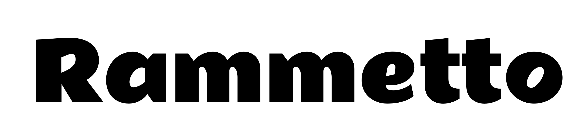

# Rammetto Project
by Vernon Adams

## Rammetto

Rammetto is a typeface based on the Stephenson Blake uppercase display font, Basuto, released in 1926. The Rammetto design refines some of the old font's forms, introduces a full set of lowercase characters and adds extended support for European languages. 

## Designer

* Vernon Adams

## License

Licensed under the [SIL Open Font License, 1.1](https://openfontlicense.org); you may only use these files in compliance with the License.

To contribute to the project, file an issue at https://github.com/googlefonts/RammettoFont